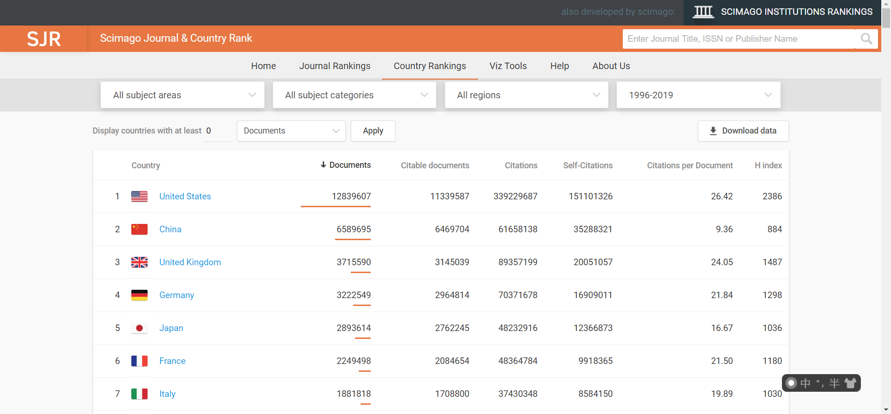
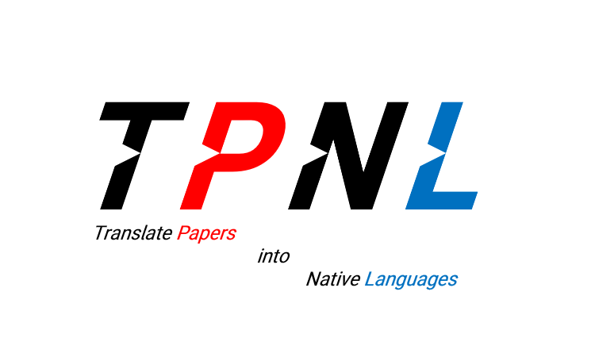

# *TPNL: Translate Papers into Native Languages*

# 简介

*TPNL(Translate Papers into Native Languages)* 宏观上是一项鼓励将外语论文翻译为母语的开源项目。

**目前，从形式上，着眼于鼓励中国人发表的英文论文，其自行翻译成中文版本，并进行公开。**

# 使命与价值

让科学知识在中国更有效率地传播，推动中国学术界的发展。

# 可行性

设想一个场景，你在一个英文期刊上发表了一篇英文论文，那么，你是否愿意将它翻译成中文然后公开呢？

1. **翻译成本低。** 可能这篇文章你一开始本来就是用中文写的，然后再翻译成英文的。
2. **翻译效果好。** 这篇文章是你写的，所以其中语句的表达和专业的名词，肯定是你最了解。你是这篇文章最好的翻译者，没有之一。如果你这篇文章是别人翻译的，很可能存在翻译错误或翻译不准确的问题。
3. **没有版权的问题。** 如果说你发表的这篇英文论文在传播时可能存在版权问题，但是这篇英文论文的中文译文不存在版权的问题。因为这篇文章就是你写的呀！我自己写的中文文章，我分享给大家，完全没问题呀！

# 意义

这是来自 https://www.scimagojr.com/countryrank.php 的数据，可以看到，从1996-2019年，中国发文章总数位于世界第二。

如果每一位发表英文论文中国人的都能将其论文翻译成中文，量变引起质变，意义深远而重大！

1. **推动科技知识在中国更好地传播。** 相较于英文来讲，中文会更好地在中国传播。道理很简单，大家都是中国人，平常也都说中文。这对于英文不是很好但又热爱科研或科学的人是莫大的幸运！
2. **促进科学前沿更好地引入国内。** 一般来说，前沿的科学知识都是发表在英文顶级期刊上的。因此，这种翻译显得更为重要。
3. **中国科研整体水平地提升。** 这种翻译以极小的成本带来极大的收益，提高的效率之大、转播的知识之多，难以估量。

# 形式

目前设想两种形式：

1. 类似于 `sci-hub` 。输入文章 `doi` 便可下载对应文章的中文版本。
2. 类似于知网。可以按关键词、标题等形式进行检索。

# 后记

欢迎大家在 `Issues` 提出自己的想法和建议！

